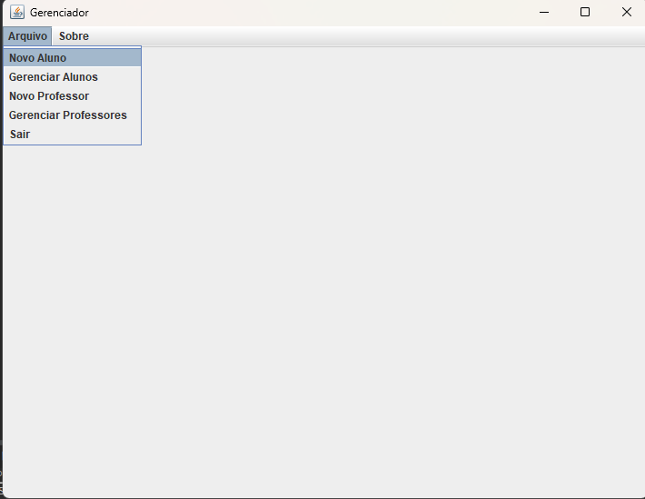
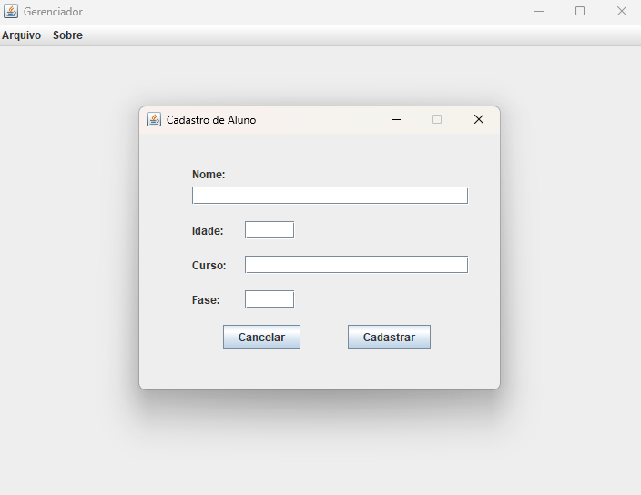

<h1 align="center" style="font-weight: bold;">Sistema de Cadastro Acadêmico 📚</h1>

<p align="center">
    <b>Uma plataforma robusta e intuitiva para gerenciamento de informações acadêmicas, permitindo o cadastro, edição e gerenciamento de alunos e professores em um banco de dados centralizado.</b>
</p>

<p align="center">
    <a href="#sobre">Sobre</a> • 
    <a href="#funcionalidades">Funcionalidades</a> • 
    <a href="#tecnologias">Tecnologias</a> • 
    <a href="#padroes">Padrões de Projeto</a> • 
    <a href="#setup">Setup e Configuração</a> • 
    <a href="#dicas">Dicas de Uso</a> • 
    <a href="#licenca">Licença</a> • 
    <a href="#contribuicoes">Contribuições</a>
</p>


---

<h2 id="sobre">📖 Sobre</h2>

O **Sistema de Cadastro Acadêmico** é uma aplicação desktop desenvolvida em Java que fornece uma solução completa para gerenciar dados acadêmicos em uma instituição educacional. Com uma interface gráfica amigável e intuitiva, o sistema permite que administradores gerenciem facilmente informações de alunos e professores, mantendo a integridade dos dados através de um banco de dados MySQL robusto.

**Autor:** Victo Reis

---

<h2 id="funcionalidades">✨ Funcionalidades</h2>

### Gerenciamento de Alunos
- ✅ Cadastro de novos alunos com dados pessoais
- ✅ Listagem completa de todos os alunos cadastrados
- ✅ Atualização de informações de alunos
- ✅ Exclusão de registros de alunos
- ✅ Busca e filtros de alunos

### Gerenciamento de Professores
- ✅ Cadastro de novos professores
- ✅ Listagem de todos os professores
- ✅ Edição de dados de professores
- ✅ Remoção de registros de professores
- ✅ Busca de professores

### Interface
- ✅ Tela principal com acesso a todas as funcionalidades
- ✅ Diálogos de feedback com mensagens de confirmação
- ✅ Tela de créditos
- ✅ Design responsivo e intuitivo

---

<h2 id="layout">🎨 Layout</h2>

<p align="center">
    
    
    
</p>

---

<h2 id="tecnologias">💻 Tecnologias</h2>

### Backend
- **Java** - Linguagem de programação principal
- **MySQL** - Sistema de gerenciamento de banco de dados relacional
- **JDBC** - API para conexão e manipulação de dados
- **SQL** - Linguagem para gerenciamento de dados

### Frontend
- **Java Swing** - Framework para construção de interfaces gráficas
- **JavaFX** - Biblioteca moderna para UI (utilizada em componentes específicos)
- **NetBeans Form Builder** - Ferramenta para design visual de formulários (.form)

---

<h2 id="padroes">🏗️ Padrões de Projeto</h2>

O projeto utiliza os seguintes padrões de design:

- **DAO (Data Access Object)** - Abstração da camada de acesso a dados, isolando a lógica de banco de dados
  - `AlunoDAO.java` - Operações CRUD para alunos
  - `ProfessorDAO.java` - Operações CRUD para professores

- **Model/Entity** - Representação dos dados através de classes de modelo
  - `Pessoa.java` - Classe abstrata base
  - `Aluno.java` - Modelo de aluno (herda de Pessoa)
  - `Professor.java` - Modelo de professor (herda de Pessoa)

- **MVC (Model-View-Controller)** - Separação entre camadas de dados, apresentação e lógica
  - Model: Classes em `/src/Model`
  - View: Componentes gráficos em `/src/View`
  - Controller: Lógica de negócio em `/src/DAO`

- **Singleton** - Garante instância única da conexão com banco de dados

---

<h2 id="setup">🚀 Setup e Configuração</h2>

### Pré-requisitos

Antes de começar, certifique-se de ter os seguintes programas instalados em sua máquina:

- **Java Development Kit (JDK)** versão 8 ou superior
  - [Download JDK](https://www.oracle.com/java/technologies/downloads/)
  
- **MySQL Server** versão 5.7 ou superior
  - [Download MySQL](https://dev.mysql.com/downloads/mysql/)
  
- **NetBeans IDE** (recomendado para desenvolvimento)
  - [Download NetBeans](https://netbeans.apache.org/)
  
- **MySQL Connector/J** (Driver JDBC)
  - Já incluído no projeto via dependências

### Passo 1: Clonar o Repositório

```bash
# Clone o repositório do GitHub
git clone https://github.com/viktor1v9/Gerenciador.git

# Navegue até a pasta do projeto
cd Gerenciador
```

### Passo 2: Configurar Banco de Dados

1. Abra o MySQL Command Line Client ou MySQL Workbench
2. Execute os seguintes comandos para criar o banco de dados:

```sql
-- Criar banco de dados
CREATE DATABASE db_alunos;

-- Usar o banco de dados
USE db_alunos;

-- Criar tabela de alunos
CREATE TABLE tb_alunos (
    id INT AUTO_INCREMENT PRIMARY KEY,
    nome VARCHAR(100) NOT NULL,
    idade INT NOT NULL
);

-- Criar tabela de professores
CREATE TABLE tb_professores (
    id INT AUTO_INCREMENT PRIMARY KEY,
    nome VARCHAR(100) NOT NULL,
    idade INT NOT NULL
);
```

### Passo 3: Configurar Conexão com Banco de Dados

Edite o arquivo `src/DAO/AlunoDAO.java` e `src/DAO/ProfessorDAO.java`:

```java
// Linha aproximadamente 42
String user = "root";           // Seu usuário MySQL
String password = "sua_senha";  // Sua senha MySQL
```

### Passo 4: Compilar e Executar

**Usando NetBeans:**
1. Abra o projeto em NetBeans
2. Clique em `Run > Run Project` ou pressione `F6`

**Usando Terminal:**
```bash
# Compilar
javac -d build/classes src/**/*.java

# Executar
java -cp build/classes:lib/* Principal.Principal
```

---

<h2 id="dicas">💡 Dicas de Uso</h2>


### Cadastrando Alunos/Professores
1. Clique no botão "Cadastrar Aluno" ou "Cadastrar Professor"
2. Preencha os campos solicitados (Nome, Idade, etc.)
3. Clique em "Salvar" para registrar no banco de dados
4. Uma mensagem de confirmação será exibida

### Gerenciando Registros
1. Acesse "Gerenciar Alunos" ou "Gerenciar Professores"
2. A lista de registros será exibida
3. Selecione um registro para editar ou deletar
4. Confirme as alterações

### Visualizando Créditos
- Clique em "Créditos" na tela principal para ver informações sobre o desenvolvedor

### Boas Práticas
- ✅ Sempre preencha todos os campos obrigatórios antes de salvar
- ✅ Verifique a conexão com o banco de dados antes de iniciar o programa
- ✅ Faça backups regulares do seu banco de dados
- ✅ Use nomes e idades válidas para manter a integridade dos dados

---

<h2 id="licenca">📝 Licença</h2>

Este projeto está licenciado sob a **MIT License** - veja o arquivo [LICENSE](LICENSE) para mais detalhes.

A MIT License permite que você use, modifique e distribua este projeto livremente, desde que inclua a atribuição original.

---

<h2 id="contribuicoes">🤝 Contribuições</h2>

Contribuições são bem-vindas! Se você encontrar um bug ou tiver uma ideia para melhorar o projeto, siga os passos abaixo:

1. **Faça um Fork** do projeto
2. **Crie uma Branch** para sua feature (`git checkout -b feature/MinhaFeature`)
3. **Commit suas mudanças** (`git commit -m 'Adiciona MinhaFeature'`)
4. **Push para a Branch** (`git push origin feature/MinhaFeature`)
5. **Abra um Pull Request**

---

<h2 align="center">✨</h2>

<p align="center">
    <b>Obrigado por usar o Sistema de Cadastro Acadêmico! 🎉</b><br>
    <i>Desenvolvido com ❤️ por Victo Reis</i><br>
    Se este projeto foi útil para você, considere deixar uma ⭐ no repositório!
</p>

